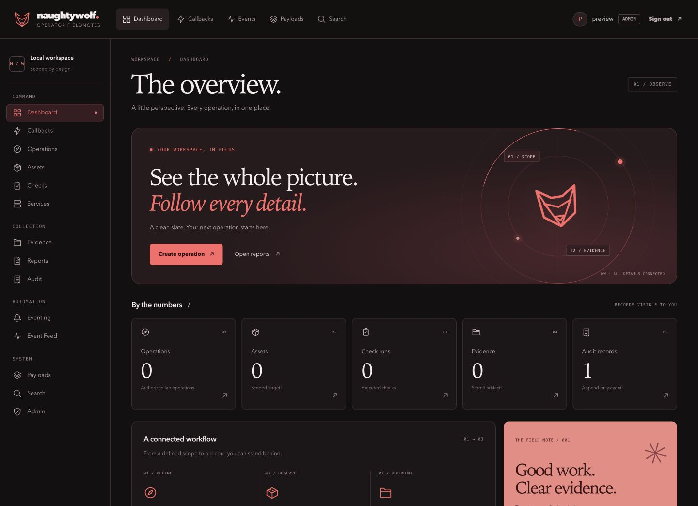
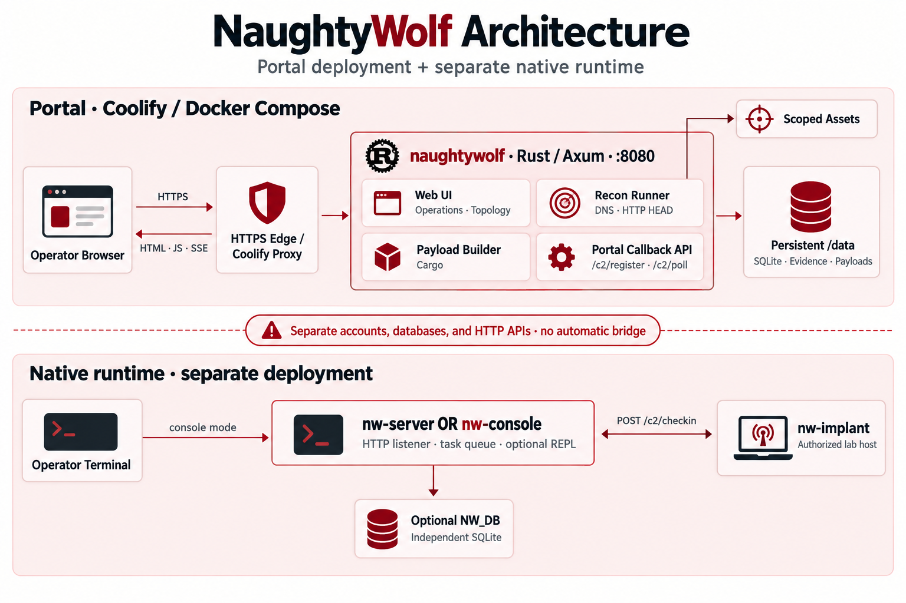
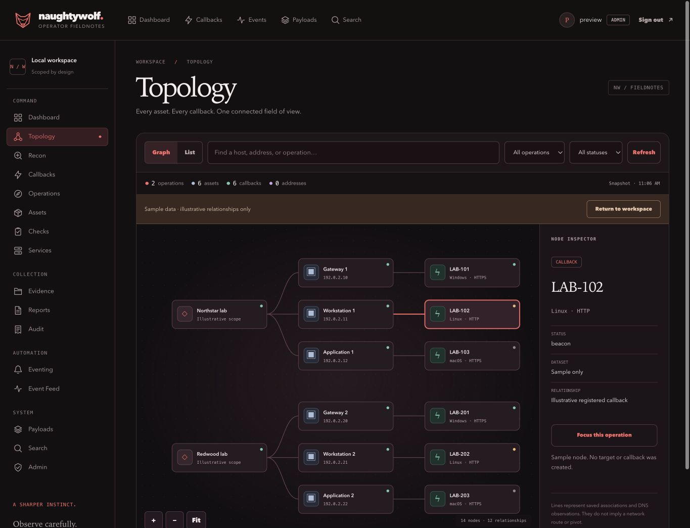
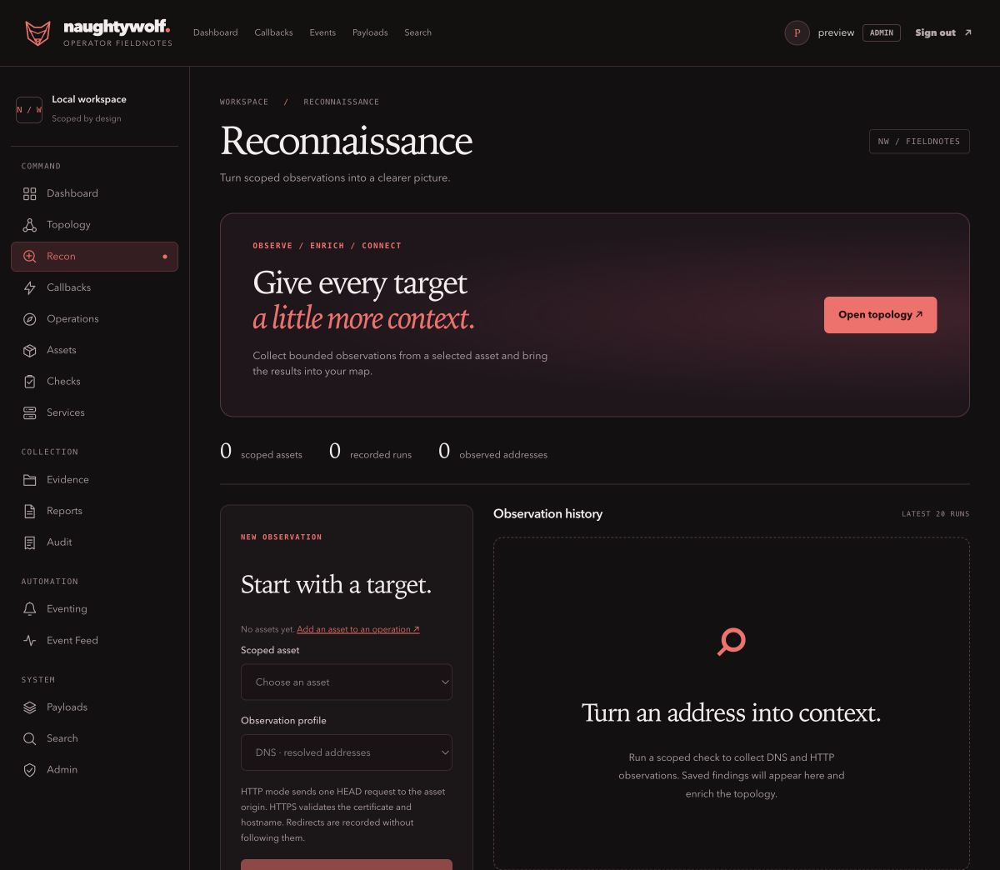
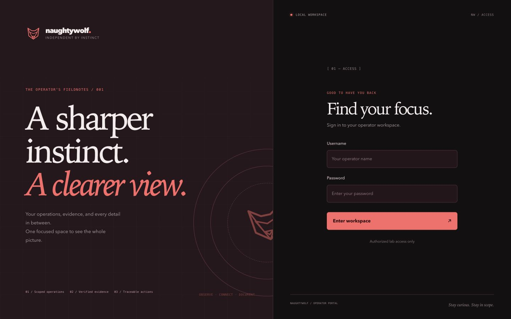
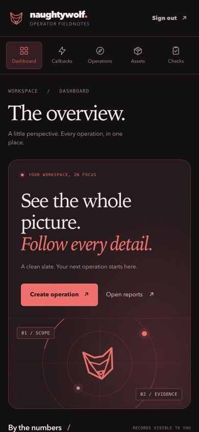
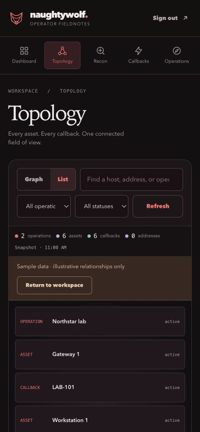

# NaughtyWolf

**A sharper instinct. A clearer view.**

A Rust workspace for authorized security labs, with a local web portal for operations, assets, check history, evidence, and reports. Keep the scope of your work and the records behind it in one place.

The interface pairs a dark red theme with editorial typography, a custom wolf mark, and responsive layouts. Menu navigation updates the page content while keeping the header and navigation in place.

[Architecture](#architecture) · [Quick start](#quick-start) · [Deploy on Coolify](docs/coolify.md) · [Screenshots](#screenshots) · [Configuration](#configuration) · [Development](#development) · [Native C2 guide](docs/c2-quickstart.md) · [Module Studio](docs/modules.md)



## What is included?

| Component | What it does | Start here |
| --- | --- | --- |
| **Web portal** — `naughtywolf` | Browser UI, local accounts, SQLite records, evidence, reports, and callback/task routes. | [Quick start](#quick-start) |
| **Native server** — `nw-server` | Standalone C2 listener with optional SQLite persistence. | [Native C2 guide](docs/c2-quickstart.md) |
| **Native console** — `nw-console` | Interactive operator console that hosts its own listener. | [Native C2 guide](docs/c2-quickstart.md) |
| **Lab client** — `nw-implant` | Client component for the native C2 workspace. | [Native C2 guide](docs/c2-quickstart.md) |

The portal and native C2 packages have separate configuration and account stores. **You only need the web portal to run the interface shown here.**

## Architecture



The Coolify deployment runs the Rust/Axum portal beside an official GSocket transport adapter. Its UI, recon runner, payload builder, callback API, and private raw-TCP listener share a persistent `/data` volume for SQLite records, evidence, and generated payloads. GSocket forwards opaque, already-encrypted NaughtyWolf frames; callback state and tasking remain owned by the portal.

The portal callback routes (`/c2/register` and `/c2/poll`) and the native endpoint (`/c2/checkin`) currently use different HTTP and wire formats. They do not automatically share accounts, sessions, tasks, or callback state. See the **[architecture guide](docs/architecture.md)** for the request flows, deployment boundary, and source-code map.

## Features

- **Operation records:** define a purpose, track assets, and keep related lab records together.
- **Scoped overview:** dashboard counts come from persisted records visible to the signed-in user.
- **Interactive topology:** map operations, assets, registered callbacks, and saved DNS observations. Search, filter, pan, zoom, inspect nodes, or switch to a list.
- **Integrated reconnaissance:** run DNS or DNS + HTTP/TLS observations against a selected active asset. Results persist in check history, enrich the topology, and leave an audit trail.
- **Payload creation studio:** configure target, callback, and beacon timing in a four-step wizard, review the non-secret profile, then build or edit native artifacts.
- **Active callback workspace:** scan session health from a compact status board, open a callback, and keep task history, live output, session context, and the command dock in one view. Tabbed Tasking / Processes / Files / Metadata sections keep their place through back/forward navigation, and offline callbacks queue new tasks until their next check-in.
- **Evidence and reporting:** inspect stored artifacts and produce printable operation summaries.
- **Traceability:** an append-only audit trail records operation, asset, and account changes.
- **Local access control:** Admin, Operator, and Viewer roles, password hashing, signed sessions, and CSRF-protected forms.
- **Evidence verification:** downloads check the stored path, file type, length, and SHA-256 digest.
- **Responsive interface:** desktop navigation, a scrollable mobile menu, locally bundled icons and scripts, keyboard focus indicators, and reduced-motion support.
- **Anime.js motion:** staggered content entrances, a drawn wolf logo, dashboard orbit accents, and topology connection reveals. Motion is finite, stops when the tab is hidden, and respects reduced-motion preferences. Menu navigation keeps the header and navigation stationary.
- **No frontend build pipeline:** Rust renders the HTML; CSS and JavaScript ship with the binary.

## Quick start

### 1. Check the prerequisites

Install a current stable Rust toolchain with Cargo and the native compiler/linker required by your platform. The commands below use a POSIX shell and OpenSSL to generate a session secret.

The portal uses **SQLite**. It does not require a separate database server, Node.js, or npm.

### Recommended server resources

NaughtyWolf is a lightweight Rust/Axum service backed by SQLite. For a typical
authorized lab deployment, use **4 CPU cores and 4 GB RAM**. This gives the web
portal, callback handling, SQLite, recon jobs, and payload management enough
headroom to run together comfortably.

| Deployment | CPU | RAM | Suitable for |
| --- | ---: | ---: | --- |
| Minimum | 2 cores | 2 GB | Development, demos, and a small lab with a few active callbacks. |
| Recommended | 4 cores | 4 GB | Normal team use, concurrent portal activity, recon jobs, and dozens of callbacks. |
| Larger lab | 8 cores | 8 GB or more | More concurrent operators, callbacks, builds, and retained operational data. |

These are practical starting points rather than hard limits; actual usage
depends on callback frequency, concurrent recon jobs, payload builds, log
volume, and retained evidence. Keep at least **10 GB of free disk space** for
the application, SQLite database, logs, evidence, and generated payloads. If
you compile NaughtyWolf on the same machine, **4 GB RAM is the practical
minimum for the Rust build**, while 8 GB provides smoother builds. A
precompiled release binary generally needs fewer resources at runtime.

### 2. Clone and build the portal

```bash
git clone https://github.com/Aryma-f4/naughtywolf.git
cd naughtywolf
cargo build -p naughtywolf --bin naughtywolf
```

### 3. Configure your local workspace

Run these commands in the same terminal you will use to create accounts and start the server:

```bash
export NAUGHTYWOLF_DATABASE_URL='sqlite:naughtywolf.db?mode=rwc'
export NAUGHTYWOLF_BIND='127.0.0.1:8080'
export NAUGHTYWOLF_SESSION_SECRET="$(openssl rand -hex 32)"
export NAUGHTYWOLF_COOKIE_SECURE=false
```

For repeat starts, save these settings—including the generated secret—in your gitignored `.env` file. The portal loads `.env` on startup; existing shell environment variables take precedence. Keep the session secret stable across restarts to preserve signed sessions.

The supplied [`.env.example`](.env.example) documents the current portal settings. When creating a new configuration, copy it to `.env` and replace the placeholder secrets.

### 4. Create your administrator

```bash
cargo run -p naughtywolf -- user create --username admin --role admin
```

Enter a password at the terminal prompt. There is no default portal login. The database and schema are initialized automatically.

### 5. Start the server

```bash
cargo run -p naughtywolf -- serve
```

Open **[http://127.0.0.1:8080/login](http://127.0.0.1:8080/login)** and sign in with your new account.

The server exposes a health endpoint at `/healthz`; a healthy process returns HTTP `204`.

## Your first workflow

For hosted deployment, follow the **[Coolify guide](docs/coolify.md)**: select the Docker Compose build pack, use `/docker-compose.yml`, set the session, C2, and GSocket secrets, assign an HTTPS domain to service `app` on internal port `8080`, and deploy. Database, evidence, and generated payloads persist in `/data`. The private raw listener on port `4630` is reachable only by the GSocket sidecar.

1. **Define an operation.** As an Admin, open **Operations → Create operation** and enter its name and purpose.
2. **Record the assets.** Use **Add asset** on an operation to register its scoped targets.
3. **Explore the relationships.** Open **Topology** to see recorded operation → asset → callback associations. Select a node to inspect its details.
4. **Collect observations.** Review and activate the operation, then open **Recon**, choose an active asset and an observation profile, and run the check. DNS addresses from the latest recon run appear in the topology.
5. **Read the summary.** Open **Checks** for recorded runs, **Reports** for operation summaries, and **Audit** to trace recorded changes.

A fresh workspace starts with zero operations, assets, checks, and evidence. Creating an account can already produce an audit record. Dashboard figures are stored counts, not sample analytics.

### Topology and recon

The topology uses persisted associations, including an asset link only when the callback belongs to the same operation. Unassigned callbacks remain unlinked. Lines describe recorded relationships, not discovered network routes. Viewer accounts can inspect scoped assets and recon results; callback nodes require Operator or Admin access.

Use search and the operation/status filters to focus a large inventory. Parent nodes remain visible for context. At most **240 nodes** are drawn at once; the counter discloses omitted nodes. Drag the canvas to pan, use **+ / −** to zoom, and **Fit** to center the graph. Keyboard users can select nodes with Enter or Space and use arrow keys, + / −, and 0 while the canvas is focused. **Refresh** loads a new snapshot; the graph does not auto-poll. An empty workspace offers a clearly labelled sample graph that creates no records.

| Recon profile | Observations |
| --- | --- |
| **DNS** | Up to 16 resolved IPv4/IPv6 addresses. A literal IP is recorded directly. |
| **DNS + HTTP / TLS** | DNS plus one HEAD request to the asset origin, its HTTP status, and selected response headers. HTTPS verifies the certificate and hostname. |

Recon requires an active asset in an active operation and an Operator or Admin account with access to that operation. Hostnames and bare IP addresses default to HTTPS; an explicit `http://` URL selects HTTP. URL paths, queries, fragments, and embedded credentials are not sent. Redirects are observed without following them; response bodies and cookies are not collected. Proxy environment variables are ignored. Loopback and private lab addresses are supported; unspecified, multicast, and link-local destinations are rejected.

Each run has a 15-second execution limit, an 8 KiB saved-output limit, and shares four execution slots per portal process. Results remain available in Recon and Checks, including partial DNS findings if HTTP fails. Recon history shows the latest 20 runs for the selected asset or all visible assets. This is a scoped observation workflow; it does not include port sweeps, autonomous exploit agents, or a RedAmon service dependency.

## Screenshots

Captured from the running application using an isolated local preview account. The topology screenshot uses the built-in labelled sample dataset; the other views show a fresh workspace. They do not contain live operation data.

### Connected topology



### Recon workspace



### Operator access



### Mobile workspace

The navigation scrolls horizontally, and the dashboard reflows for a narrow screen.



Topology also offers a compact list with the same search, filters, and node inspector.



The desktop dashboard is shown at the top of this README. Original screenshots are in [`docs/screenshots`](docs/screenshots).

## Pages and access

| Page | Route | Purpose |
| --- | --- | --- |
| Dashboard | `/dashboard` | Visible operation, asset, check, evidence, and audit counts. |
| Topology | `/topology` | Interactive relationship map, filters, node inspector, and list view. |
| Recon | `/recon` | Scoped DNS/HTTP observations and saved results; execution requires Operator or Admin. |
| Operations | `/operations` | Operation records and asset creation. |
| Assets | `/inventory` | Inventory for visible operations. |
| Checks | `/checks` | Recorded check-run history. |
| Evidence | `/evidence` | Artifact metadata and verified downloads. |
| Reports | `/reports` | Printable summaries from stored operation records. |
| Audit | `/audit` | Recorded actions and outcomes. |
| Active Callbacks | `/callbacks` | Session status board, callback inventory, task history, live output, and interaction workspace. |
| Services | `/services` | Service records. |
| Eventing | `/eventing` | Event-rule configuration. |
| Event feed | `/events` | Workspace event records. |
| Create Payload | `/payloads` | Four-step native payload wizard and generated artifact library. |
| Search | `/search` | Search available workspace records. |
| Administration | `/admin/users` | Local account roles and enabled state. |

Callbacks, services, eventing, the event feed, payloads, and search require an Operator or Admin account. Administration requires an Admin account.

| Role | Portal permissions |
| --- | --- |
| **Admin** | View all operation records, create operations, and manage local accounts. |
| **Operator** | Work with assigned operations, add scoped assets, and access operator pages. |
| **Viewer** | Read assigned operation records; no mutation or operator-only controls. |

Operation-related records for non-Admin users are limited by operation membership. A newly created Operator or Viewer account does not automatically gain access to every operation. In the administration UI, administrators cannot disable their own account or change their own role.

## Configuration

Portal settings are read from the process environment or `.env` in the working directory.

| Variable | Default | Purpose |
| --- | --- | --- |
| `NAUGHTYWOLF_DATABASE_URL` | `sqlite:naughtywolf.db?mode=rwc` | SQLite connection URL. Use the same value for account commands and the server. |
| `NAUGHTYWOLF_BIND` | `127.0.0.1:8080` | HTTP bind address and port. |
| `NAUGHTYWOLF_SESSION_SECRET` | Required | Secret of at least 32 bytes for signing sessions. |
| `NAUGHTYWOLF_COOKIE_SECURE` | `false` | Set to `true` when serving the portal through HTTPS. |
| `NAUGHTYWOLF_EVIDENCE_DIR` | `evidence` | Root directory for evidence files. |
| `NAUGHTYWOLF_C2_PSK` | `dev-psk-change-me` | Shared key for the portal's C2 routes. Replace before using those routes. |
| `NAUGHTYWOLF_TCP_BIND` | unset | Private raw C2 listener. Compose sets `0.0.0.0:4630` inside its private network. |
| `NAUGHTYWOLF_TCP_PROTOCOL` | `tcp` | Callback protocol label for the raw listener; Compose uses `gs`. |
| `GSOCKET_SECRET` | required by Compose | GSocket tunnel secret; keep it different from `NAUGHTYWOLF_C2_PSK`. |
| `RUST_LOG` | `info,naughtywolf=debug` | Logging filter. |

Relative database and evidence paths resolve from the working directory. Keep that directory consistent between runs.

The `NW_*` variables used by the native C2 packages are documented in the [separate guide](docs/c2-quickstart.md).

## Account management

Run these from a terminal configured for the same database as the server:

```bash
# Create an account; the password is prompted interactively.
cargo run -p naughtywolf -- user create --username reviewer --role viewer

# List accounts.
cargo run -p naughtywolf -- user list

# Reset an account password interactively.
cargo run -p naughtywolf -- user reset-password --username reviewer

# Disable an account.
cargo run -p naughtywolf -- user disable --username reviewer
```

For CI, account creation and password reset also accept `--password-stdin`. Use an interactive prompt for normal local administration.

## Development

### UI changes require a restart

The active portal renders templates from `src/portal/templates.rs` and `src/portal/workspace.rs`. It embeds `static/admin.css`, `static/admin.js`, `static/workspace.css`, `static/workspace.js`, `static/motion.js`, and `static/anime.min.js` at compile time.

After editing them, stop the running server and run:

```bash
cargo run -p naughtywolf -- serve
```

Cargo rebuilds changed assets. Then refresh the browser once. Subsequent menu navigation updates the main content without replaying navbar animations. Back/Forward keeps the browser history intact, rapid clicks keep the latest selection, and a failed request leaves the current view available with a retry link.

The older `static/app.html`, `static/app.js`, and `static/style.css` files are not the active portal UI.

### Validation

```bash
# Check Rust formatting across the workspace.
cargo fmt --all --check

# Check JavaScript syntax (requires Node.js for this check only).
node --check static/admin.js
node --check static/workspace.js
node --check static/motion.js

# Run navigation regression tests (requires Node.js, no npm install).
node --test tests/navigation_test.cjs tests/workspace_test.cjs tests/motion_test.cjs

# Run the portal route, rendering, and access-control tests.
cargo test -p naughtywolf --test portal_routes_test

# Run the full workspace test suite.
cargo test --workspace
```

### Repository map

```text
src/
  main.rs                 Portal startup, sessions, and login
  portal.rs               Portal routes and handlers
  portal/templates.rs     Active HTML templates
  portal/workspace.rs     Topology and recon routes, rendering, and scoped graph data
  checks/recon.rs         Bounded DNS and HTTP/TLS observations
  auth/                   Passwords, sessions, and roles
  db/                     SQLite models and repositories
  evidence.rs             Evidence storage and verification
static/
  admin.css               Active portal theme and responsive layouts
  admin.js                Content navigation and interactions
  workspace.css           Topology and recon layouts
  workspace.js            Graph model, interactions, and recon form navigation
  motion.js               Anime.js accents and motion-preference lifecycle
  anime.min.js            Bundled animation library
migrations/               Database schema migrations
crates/                   Native server, console, client, and shared code
tests/                    Portal and data-layer integration tests
docs/
  screenshots/            Screenshots used in this README
  c2-quickstart.md         Native C2 setup
```

## Troubleshooting

| Symptom | What to check |
| --- | --- |
| Server reports a missing or short session secret | Set `NAUGHTYWOLF_SESSION_SECRET` to at least 32 bytes in the environment or `.env`. |
| Login fails after creating an account | Confirm the CLI and server use the same database URL and working directory. |
| Login does not persist on local HTTP | Use `NAUGHTYWOLF_COOKIE_SECURE=false` for local HTTP; use `true` with HTTPS. |
| UI changes do not appear | Rebuild and restart the server, then refresh the page. CSS and JavaScript are embedded in the binary. |
| Port 8080 is already in use | Stop the existing instance or set `NAUGHTYWOLF_BIND=127.0.0.1:8082` and open that port. |
| An Operator or Viewer sees no operations | Check operation membership; account creation alone does not grant access to existing operations. |
| You expect a browser UI after starting `nw-server` | Start the `naughtywolf` portal. The native server is a separate entry point. |
| Container/Coolify setup | Use the [Coolify guide](docs/coolify.md). The current root Compose file uses SQLite and a persistent `/data` volume. |

## Intended use

NaughtyWolf is intended for authorized security-lab work on systems you own or have explicit permission to test. The quick start binds the portal to loopback for local development. For a remote deployment, serve it through HTTPS, enable secure cookies, replace development secrets, and protect the database and evidence directory with operating-system access controls.
