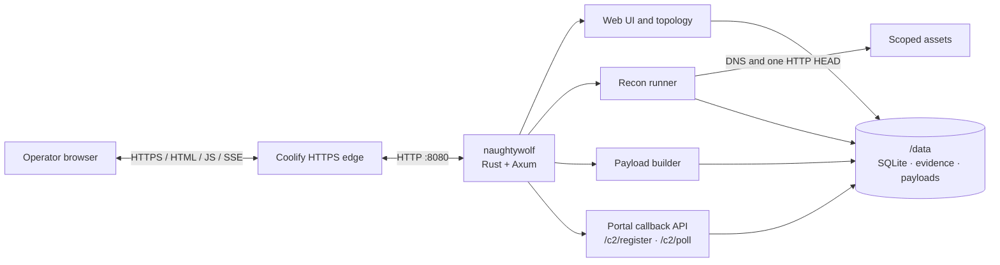
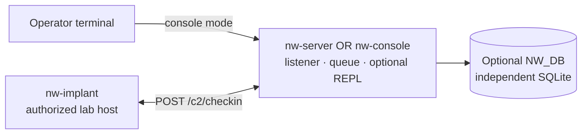

# NaughtyWolf architecture

NaughtyWolf contains two related but separately deployed systems. The web portal is the application shown in the README screenshots and is the service deployed by the supplied Coolify Compose configuration. The native C2 crates provide a separate listener, console, and lab client.

## Portal deployment

The `naughtywolf` binary is a Tokio/Axum application. In the supplied Compose deployment, Coolify terminates public HTTPS traffic and proxies it to port `8080` in the app container.

The same process owns these portal capabilities:

- server-rendered browser UI with locally bundled CSS, JavaScript, and Anime.js;
- operations, assets, checks, evidence, reports, topology, and audit records;
- scoped DNS and HTTP HEAD observations through the recon runner;
- payload builds using the Rust workspace and toolchain included in the image;
- portal callback registration, polling, task submission, and task-result events.

SQLite data, evidence, and generated payloads live under the persistent `/data` volume in the Compose deployment. No PostgreSQL, GraphQL service, message broker, or separate frontend container is required.

## Native runtime

The native crates are a separate deployment path:

- `nw-server` starts the native HTTP listener and task runtime;
- `nw-console` starts its own listener and adds an in-process operator REPL;
- `nw-implant` sends sealed check-ins to `POST /c2/checkin` from an authorized lab host;
- `NW_DB` enables native SQLite persistence; without it, runtime registry and queue state are in memory.

Run `nw-server` or `nw-console` for a native runtime. The console is an alternative entry point that hosts the listener itself, rather than a remote client for an already running `nw-server` process.

## Integration boundary

The portal and native runtime share workspace libraries and project goals, but they are not one distributed runtime today. In particular:

| Boundary | Portal | Native runtime |
| --- | --- | --- |
| Main entry point | `naughtywolf serve` | `nw-server` or `nw-console` |
| HTTP callback routes | `/c2/register`, `/c2/poll` | `/c2/checkin` |
| Configuration prefix | `NAUGHTYWOLF_*` | `NW_*` |
| Persistence | Portal SQLite and `/data` artifacts | Optional, independent `NW_DB` SQLite |
| Accounts and sessions | Portal users and signed browser sessions | Native operator store and native sessions |
| Coolify Compose service | Included | Not included |

Building an `nw-implant` artifact in the portal does not create a live bridge between these systems. A generated artifact must be deployed only to an authorized lab host and pointed at a compatible native runtime. Any future bridge needs an explicit protocol adapter plus a deliberate identity, task, and persistence model.

## Source map

| Area | Source |
| --- | --- |
| Portal composition and startup | [`src/main.rs`](../src/main.rs) |
| Portal callback routes | [`src/c2.rs`](../src/c2.rs) |
| Recon execution | [`src/checks/recon.rs`](../src/checks/recon.rs) |
| Payload builds | [`src/payload.rs`](../src/payload.rs) |
| Native server entry point | [`crates/server/src/main.rs`](../crates/server/src/main.rs) |
| Native listener and state | [`crates/server/src/server.rs`](../crates/server/src/server.rs) |
| Native HTTP channel | [`crates/server/src/channels.rs`](../crates/server/src/channels.rs) |
| Native console entry point | [`crates/console/src/main.rs`](../crates/console/src/main.rs) |
| Implant transport | [`crates/implant/src/transport.rs`](../crates/implant/src/transport.rs) |
| Coolify deployment | [`docker-compose.yml`](../docker-compose.yml) |
